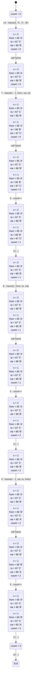

```mermaid
stateDiagram-v2
    S0: count = 0
    S1: <hr>n = 2<br>from = 65 'A'<br>to = 67 'C'<br>via = 66 'B'<br>count = 0
    S2: <hr>n = 2<br>from = 65 'A'<br>to = 67 'C'<br>via = 66 'B'<br>count = 0
    S3: <hr>n = 2<br>from = 65 'A'<br>to = 67 'C'<br>via = 66 'B'<hr>n = 1<br>from = 65 'A'<br>to = 66 'B'<br>via = 67 'C'<br>count = 0
    S4: <hr>n = 2<br>from = 65 'A'<br>to = 67 'C'<br>via = 66 'B'<hr>n = 1<br>from = 65 'A'<br>to = 66 'B'<br>via = 67 'C'<br>count = 0
    S5: <hr>n = 2<br>from = 65 'A'<br>to = 67 'C'<br>via = 66 'B'<hr>n = 1<br>from = 65 'A'<br>to = 66 'B'<br>via = 67 'C'<br>count = 1
    S6: <hr>n = 2<br>from = 65 'A'<br>to = 67 'C'<br>via = 66 'B'<br>count = 1
    S7: <hr>n = 2<br>from = 65 'A'<br>to = 67 'C'<br>via = 66 'B'<hr>n = 1<br>from = 65 'A'<br>to = 67 'C'<br>via = 66 'B'<br>count = 1
    S8: <hr>n = 2<br>from = 65 'A'<br>to = 67 'C'<br>via = 66 'B'<hr>n = 1<br>from = 65 'A'<br>to = 67 'C'<br>via = 66 'B'<br>count = 1
    S9: <hr>n = 2<br>from = 65 'A'<br>to = 67 'C'<br>via = 66 'B'<hr>n = 1<br>from = 65 'A'<br>to = 67 'C'<br>via = 66 'B'<br>count = 2
    S10: <hr>n = 2<br>from = 65 'A'<br>to = 67 'C'<br>via = 66 'B'<br>count = 2
    S11: <hr>n = 2<br>from = 65 'A'<br>to = 67 'C'<br>via = 66 'B'<hr>n = 1<br>from = 66 'B'<br>to = 67 'C'<br>via = 65 'A'<br>count = 2
    S12: <hr>n = 2<br>from = 65 'A'<br>to = 67 'C'<br>via = 66 'B'<hr>n = 1<br>from = 66 'B'<br>to = 67 'C'<br>via = 65 'A'<br>count = 2
    S13: <hr>n = 2<br>from = 65 'A'<br>to = 67 'C'<br>via = 66 'B'<hr>n = 1<br>from = 66 'B'<br>to = 67 'C'<br>via = 65 'A'<br>count = 3
    S14: count = 3
    S15: 
    [*] --> S0
    S0 --> S1 : 14 - hanoi(2, 'A', 'C', 'B')
    S1 --> S2 : call hanoi
    S2 --> S3 : 7 - hanoi(n - 1, from, via, to)
    S3 --> S4 : call hanoi
    S4 --> S5 : 5 - count++
    S5 --> S6 : 11 - }
    S6 --> S7 : 8 - hanoi(1, from, to, via)
    S7 --> S8 : call hanoi
    S8 --> S9 : 5 - count++
    S9 --> S10 : 11 - }
    S10 --> S11 : 9 - hanoi(n - 1, via, to, from)
    S11 --> S12 : call hanoi
    S12 --> S13 : 5 - count++
    S13 --> S14 : 11 - }
    S14 --> S15 : 15 - }
```
